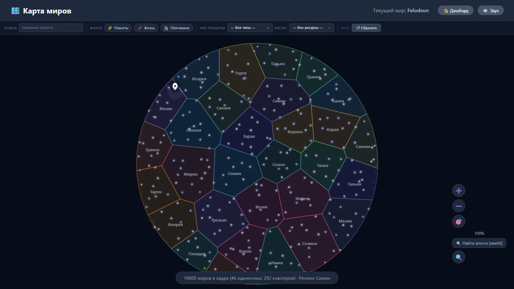
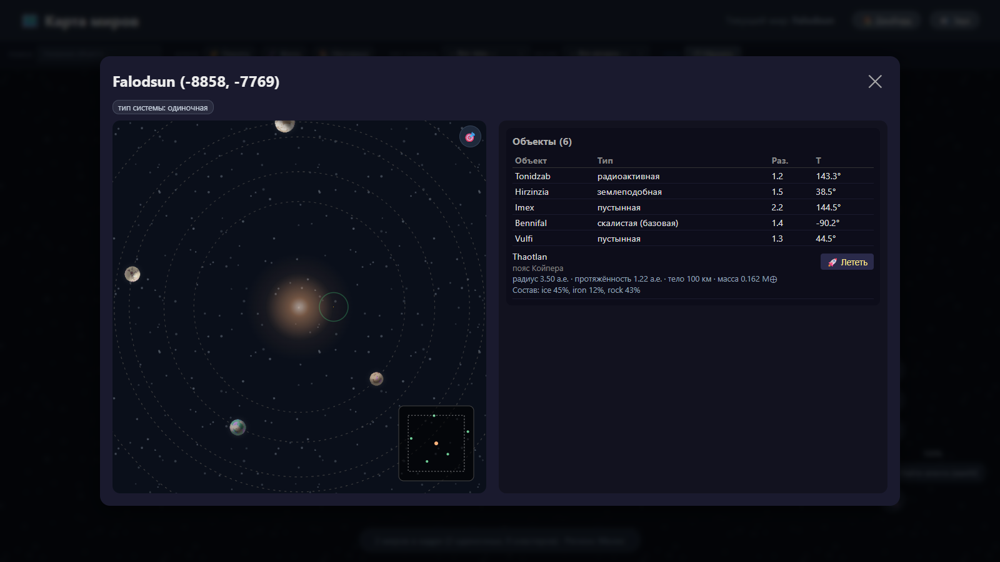
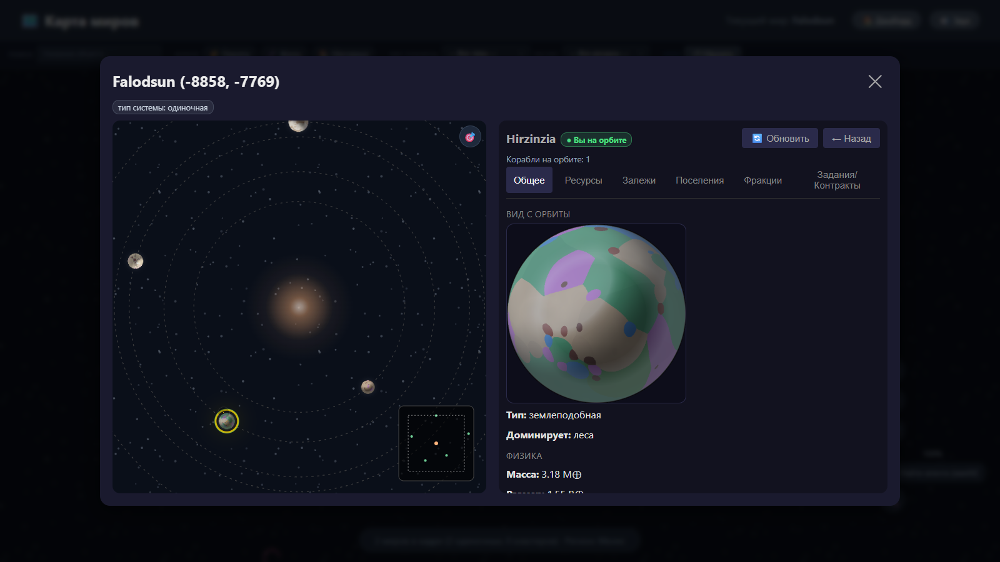
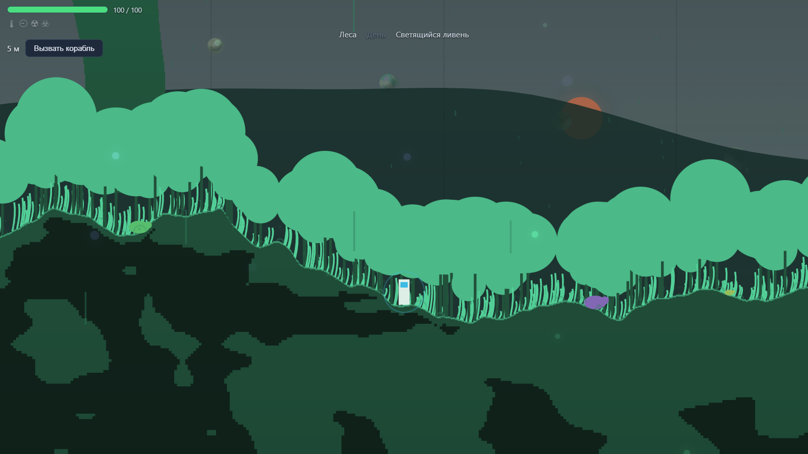
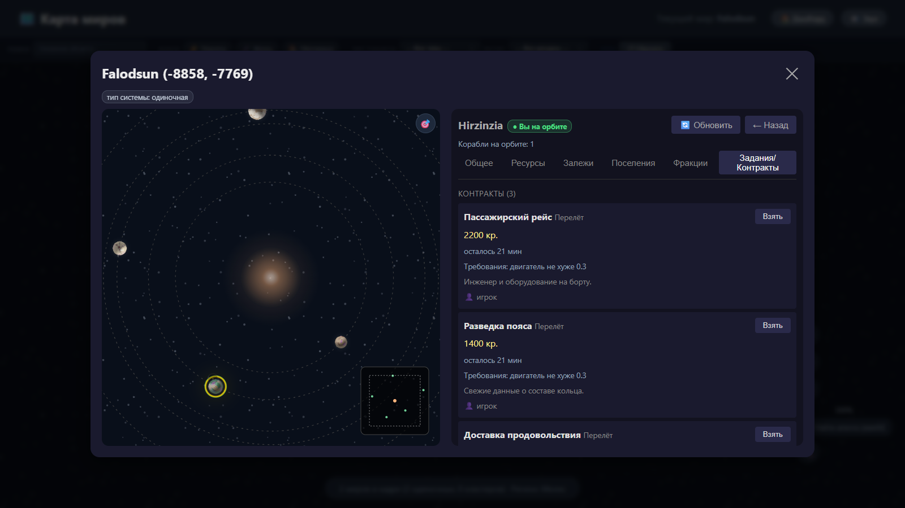

# Zorion

**An MMO sandbox where the world lives on its own.**

Zorion is a persistent multiplayer world that keeps running whether or not anyone is watching. Planets are generated from a physical model of a protoplanetary cloud; settlements grow, consume and produce; money moves through contracts between players and agents. You are one agent inside it — fly, land, walk, take jobs, and change the world as a side effect.

*The galaxy in one view: 10 000 worlds, 30 named regions, 292 star clusters and 46 single stars.*

## What's inside

- **A universe, not a map.** Galaxy → stars → planets, moons, circumbinary systems, asteroid and Kuiper belts. Planet mass and composition come from the same cloud budget: what a planet is made of follows from where and how it formed.

*One system, six objects — five planets and a Kuiper belt, listed by distance from the star.*

- **Portraits nobody drew.** Every planet gets its own surface image rendered on the fly — height field, torn continents, atmosphere modes, 57 biomes with their own icons.

*A planet's portrait, rendered from its own height field.*

- **You can stand on it.** Land and walk a planet in a side-view canvas world: day cycle, weather driven by the planet's pressure and radiation, life that belongs to the biome.

*Standing on a planet: forest biome, daylight, glowing rain.*

- **Living economy.** Settlements with population, surface deposits, production branches with input and output buffers, factories and recipes, faction capitals. Contracts carry real money through escrow.

*Contracts board: delivery offers with prices, deadlines and requirements.*

- **Two kinds of travellers.** Players and NPC agents fly the same routes, take the same jobs, and live by the same rules.
- **Races as a system, not decoration.** Race families from humans to purely aquatic, each with its own diet, body plan and ships — 60 race documents and 60 ship designs, with ship art generated by an in-house SDXL studio that cuts, checks and normalises every sprite automatically.
- **One shared world.** Real time over WebSocket, including galaxy-scale admin events that every connected player watches live.

## How it's built

Go on the back end — event store with snapshots in PostgreSQL, Redis, WebSocket — and a hand-written Canvas 2D front end in vanilla JavaScript. No game engine, no UI framework. Around 100k lines of Go and 23k lines of JavaScript, 73 database migrations, 202 test files run with the race detector.

## How it's made

Zorion is built solo, with a fleet of AI agents doing the typing under human gates. The work is split into seven streams; every feature starts as a written spec, and no stage passes without an independent critic and an independent tester. Around 100 ideas and 64 specs have gone through that pipeline — along with the agents' own tooling: a loop guard, a cost dashboard, and written retrospectives every time a stage burns through its iteration budget. The interesting part of Zorion is not only the game, it is the process that builds it.

## Contact

Telegram: [@llththeh](https://t.me/llththeh) · Email: skycomposer@gmail.com

---

# Zorion — по-русски

**MMO-песочница, в которой мир живёт сам.**

Zorion — постоянный многопользовательский мир, который продолжает жить, смотрят на него или нет. Планеты рождаются из физической модели протопылевого облака, поселения растут, потребляют и производят, деньги ходят через контракты между игроками и агентами. Вы — один из агентов внутри: летаете, садитесь на планеты, ходите по ним, берёте задания и меняете мир как побочный эффект.

## Что внутри

- **Это вселенная, а не карта.** Галактика → звёзды → планеты, спутники, двойные системы, пояса астероидов и пояс Койпера. Масса и состав планеты считаются из того же бюджета облака: из чего планета состоит, следует из того, где и как она образовалась.
- **Портреты, которых никто не рисовал.** Каждая планета получает собственную картинку поверхности, нарисованную на лету: поле высот, рваные материки, режимы атмосферы, 57 биомов со своими иконками.
- **На неё можно встать.** Садитесь на планету и идите по ней в мире с видом сбоку: смена суток, погода, зависящая от давления и радиации планеты, жизнь, принадлежащая биому.
- **Живая экономика.** Поселения с населением, залежи на поверхности, производственные ветки со входным и выходным буфером, фабрики и рецепты, столицы фракций. Контракты проводят настоящие деньги через эскроу.
- **Два вида путешественников.** Игроки и NPC-агенты летают одними маршрутами, берут одни и те же задания и живут по одним правилам.
- **Расы как система, а не украшение.** Семейства рас — от людей до чисто водных: своя диета, свой план тела, свои корабли. 60 документов рас и 60 проектов кораблей, а картинки кораблей генерирует собственная SDXL-студия: она сама вырезает, проверяет и нормализует каждый спрайт.
- **Один общий мир.** Всё в реальном времени через WebSocket, включая галактические события админов, которые видят все подключённые игроки.

## На чём сделано

Бэкенд — Go: event store со снэпшотами в PostgreSQL, Redis, WebSocket. Фронтенд — Canvas 2D, написанный руками, на чистом JavaScript: ни игрового движка, ни UI-фреймворка. Около 100 тысяч строк Go и 23 тысячи строк JavaScript, 73 миграции базы, 202 файла тестов с детектором гонок.

## Как это делается

Zorion делается в одиночку, а печатает команда ИИ-агентов — под человеческими гейтами. Работа разделена на семь направлений, каждая фича начинается с написанной спеки, и ни один этап не проходит без независимого критика и независимого тестера. Через этот конвейер прошло около 100 идей и 64 спеки — вместе с инструментами самих агентов: сторожем зацикливания, панелью расходов и письменными ретроспективами каждый раз, когда этап выжигает свой бюджет итераций. В Zorion интересна не только игра — интересен процесс, которым она строится.

## Связаться

Telegram: [@llththeh](https://t.me/llththeh) · Почта: skycomposer@gmail.com
